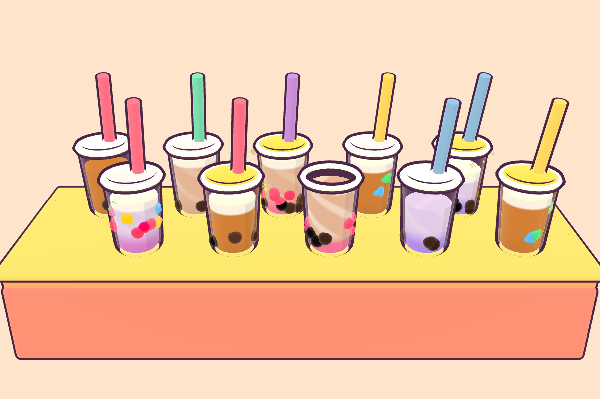
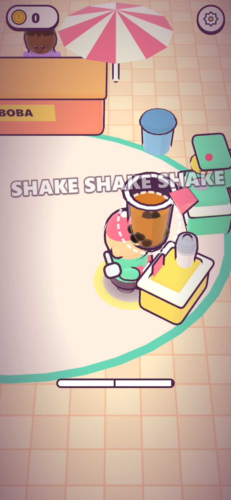
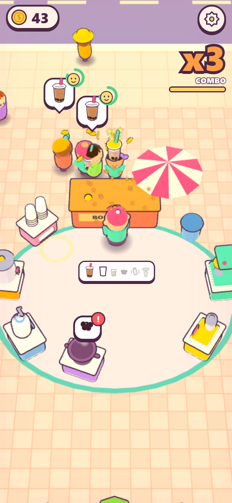
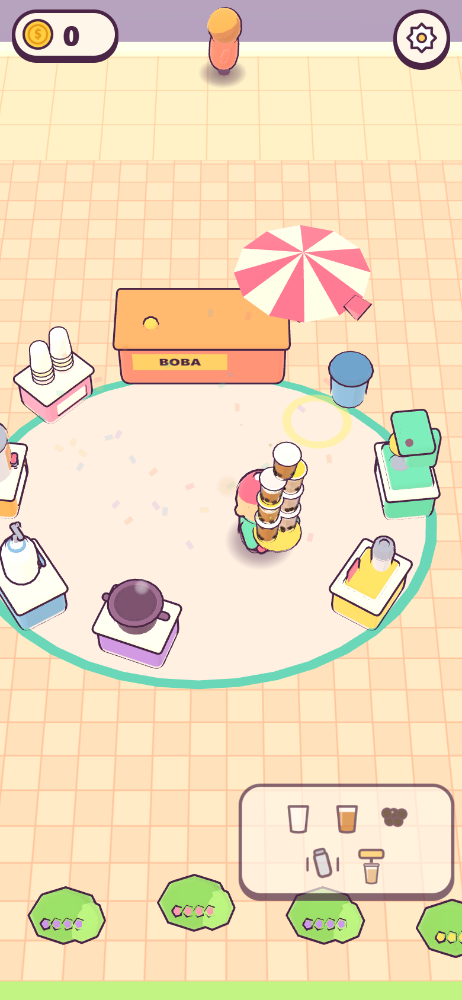
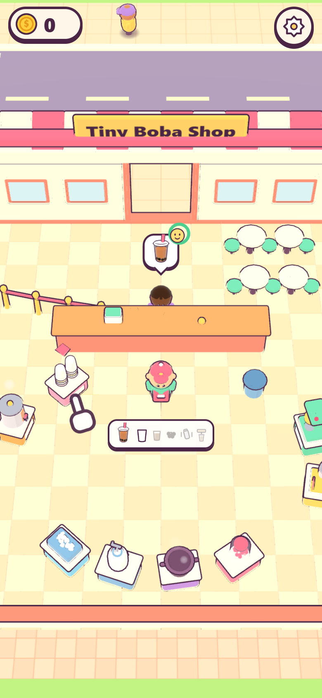

# Boba Tycoon

**▶ Play: https://jacerowe.github.io/boba-tycoon/**

A cute, tactile 3D boba restaurant game for phone and desktop browsers. Start with a tiny cart and make every drink by hand: walk the stations, **swipe to shake** (a better shake makes a better drink), **tap to seal** (CHUNK!), serve impatient customers, carry wobbling towers of cups, survive **Drink Rushes** that build combos, and buy upgrades that fix problems you can see. About eight to ten minutes in, the cart becomes a **Tiny Boba Shop**, and the camera pulls back to show a street full of empty lots.



| | | | |
|---|---|---|---|
|  |  |  |  |

## How to play

- **Move:** drag anywhere for a floating joystick, or tap the ground to walk there. On desktop: WASD / arrow keys, or click to move.
- **Plan a route:** tap stations to queue them (numbered dots show the path); tap a queued station again to remove it.
- **Make a drink:** follow the glowing station. Grab a cup → pour → scoop toppings → **shake** → **seal** → hand it over at the counter.
- **Shake:** swipe back and forth (or move the mouse, or alternate ←/→ keys) in rhythm with the dashed ring. OK → GREAT (foam) → PERFECT (gold lid + sparkles, bigger tips).
- **Seal:** tap anywhere (or press Space/Enter). CHUNK!
- **Upgrades:** stand on a glowing pad to pay into it. Pads only appear when their problem shows up.
- **Drink Rush:** everything speeds up. Serve fast to build COMBO x2 → x3 → x5 → x10. A walkout means COMBO BROKEN.

### Playing on a phone

1. Open the link in **Safari** (iPhone) or **Chrome** (Android). Portrait works best; landscape works too.
2. Optional: **Share → Add to Home Screen** for a full-screen app icon.
3. Tap to start. That also turns on the sound.
4. **iPhone silent switch mutes all game audio** (it's Web Audio). Flip it to hear the music and the CHUNK.
5. **Haptics work on Android only.** iOS Safari has no vibration API, so the toggle is hidden there.
6. To check you have the newest build, open ⚙ Settings: the build hash is at the bottom. If it's old, reload the page.

### Reading the FPS overlay (`?debug=1`)

Open `https://jacerowe.github.io/boba-tycoon/?debug=1` on your phone. The box in the bottom-right shows:

- `fps`: frames per second. 55–60 is great, 30+ is fine; below 30 feels choppy.
- `p95` / `p99`: 95th/99th-percentile frame time in ms. Under 16.7 / 33 is the target. Spikes here are hitches you can feel.
- `cpu`: ms the game's own JavaScript took last frame.
- `calls` / `tris`: draw calls and triangles (budget: ≤120 / ≤150k in the busiest scene).
- `tex`, `dpr`: textures loaded, and the device pixel ratio (the game lowers it automatically if frames get slow).

## Develop

```bash
npm install
npm run dev
```

Then open http://localhost:5173/boba-tycoon/ (or http://localhost:5287/boba-tycoon/ with the Claude launch config).

```bash
npm test
```

Vitest runs the sim, classifier, data, rush, save and replay-determinism tests, plus the bot pacing runs (fast-forwarded, reported in game minutes).

```bash
npm run e2e
```

Playwright on Chromium phone (390×844) against a production build: input methods, the drink loop, customers and the stack, the rush, a full fresh-save-to-shop run, save/load. `npm run e2e:all` adds desktop, landscape, small phone and WebKit smoke.

```bash
npm run build
```

Typechecks and builds to `dist/` (base `/boba-tycoon/`). With `npx vite preview --port 4391` running, `node scripts/perf.mjs` measures advisory frame times on your real GPU (numbers and caveats are in `docs/DECISIONS.md`), and `node scripts/screenshots.mjs` reshoots the curated screenshots. CI (`.github/workflows/deploy.yml`) runs lint, typecheck, unit tests, build and the Chromium-phone e2e, then deploys to GitHub Pages.

### Dev flags

| Flag | Effect |
|---|---|
| `?debug=1` | FPS/draw-call overlay and the `window.__boba` test hook |
| `?seed=N` | Deterministic world seed |
| `?beat=N` or `?beat=goal` | Skip to an onboarding beat (0–10) |
| `?skipTutorial=1` | Start after the practice rush |
| `?nosave=1` | Don't read or write the save |
| `?autostart=1` | Skip the tap-to-start screen |
| `?lineup=1` | The 10-drink hero shot |
| `?balance.x.y=v`, `?feel.x.y=v` | Override any tuning value, e.g. `?balance.rush.speedMult=1.8` |

Press `~` (or tap with three fingers) for the dev panel: sliders, trigger rush, add cash, skip to beat, bots, time scale, reset.

### Tune

All numbers live in `src/config/balance.ts` and `src/config/feel.ts`, and all colors in `src/config/style.ts`. See **[docs/TUNING.md](docs/TUNING.md)**.

## Docs

- [ARCHITECTURE.md](docs/ARCHITECTURE.md): code layout, the sim/view split, and the seams for multiple shops, districts, events, Create-a-Boba and multiplayer
- [DECISIONS.md](docs/DECISIONS.md): every judgment call, one line each
- [TUNING.md](docs/TUNING.md): every knob
- [PLAYTEST.md](docs/PLAYTEST.md): what works and what's rough

No external assets: every model, face, icon, sound and song is generated in code. The web-manifest icons come from `scripts/gen-icons.mjs`.
